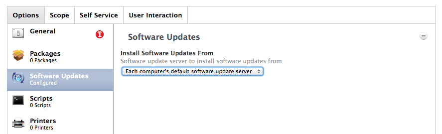
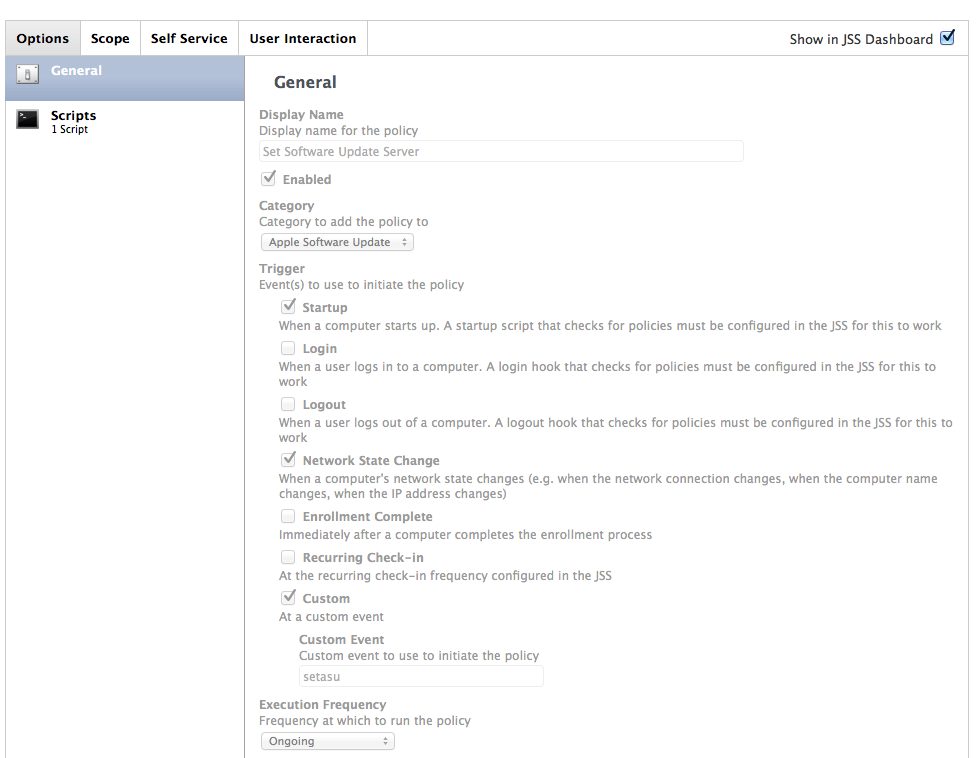

Deploying Apple Software Updates
----------------------------------

patchoo leverages existing Apple Software Update or Reposado (NetSUS) servers. 

In Casper8, it was possible to just have a policy write your [CatalogURL](http://support.apple.com/kb/HT4069) based on network segment *WITHOUT* installing them at the same time. As of Casper 9, JAMF has removed the ability and greatly simplified, now it is only possible to set the CatalogURL *AND* install *all* updates. We don't want to install all updates, we want patchoo to handle that!



If you are a small, or concentrated deployment that has a single ASU url this wont affect you, as you can write your CatalogURL directly using *defaults* or use a *configuration profile*.

If you are a large distributed organisation that has many network segments and companies to support, creating separate profiles and policies for each network segment (and perhaps each major OSX release if using Reposado/NetSUS) is cumbersome.

### asucatalogset.sh

[extras/asucatalogset.sh](extras/asucatalogset.sh)

This script will configure your clients to point directly at your local ASU server. It queries the JSS API for network segment data, and will configure the CatalogURL based on your client's primary IP.

You need to configure the `apiuser` and `apipass` with the same credentials you [setup earlier](setup_jss_api_access.md).

```
# read only api user please!
apiuser="apiuser"
apipass="apipass"

# reposado mode (netsus) will direct clients to os specific catalog urls, otherwise apple software update server is expected (that does re-writes)
# eg. if true, http://swupdate.domain:8088/content/catalogs/others/index-mountainlion-lion-snowleopard-leopard.merged-1.sucatalog for a 10.8 client
# eg. if false, http://swupdate.domain:8088/index.sucatalog would be written to the catalogURL
reposadomode=true

# if you are using a self signed cert for you jss, tell curl to allow it.
selfsignedjsscert=true

```

If you are using Reposado or NetSUS appliance, setting `reposadomode=true` will make asucatalog.sh write OSX version specific URLs, as these servers may not be configure to do dynamic re-writing.

Adjust `selfsignedjsscert=` to match your environment.

___

Create a policy to run it as follows:

* Name: `setSoftwareUpdateServer`
* Enabled: `true`
* Trigger: `startup, network state change, setasu`
* Execution: `ongoing`



___

patchoo Update Session
--------------------


1. **patchooPreUpdate** Policy fires the `update` trigger
2. **patchooCheckASU** Policy runs `patchoo.sh --checkasu` which (if using advanced mode) will write a software deployment group CatalogURL (eg. patchooBeta members on 10.8 - `http://yourasuserver.domain:port/content/catalogs/others/index-mountainlion-lion-snowleopard-leopard.merged-1_beta.sucatalog`)
3. `patchoo.sh --checkasu` downloads all require updates, and writes metadata to the support directory.
4.  **patchooPromptToInstall** is run *last* on the update trigger, the user is prompted to install.
5.  The user defers, or chooses install, and the user is logged out, pending installations are performed by **patchooPromptAndInstallAtLogout**.


