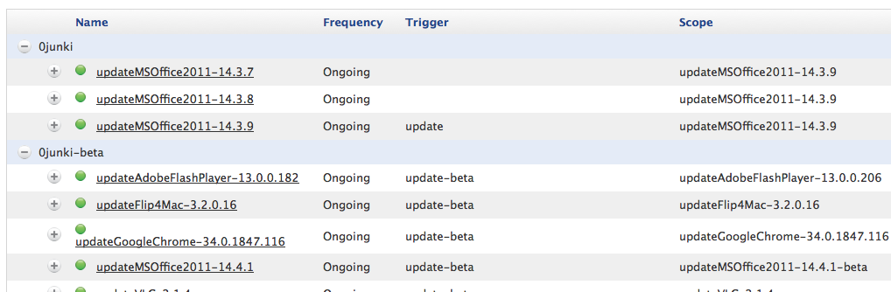
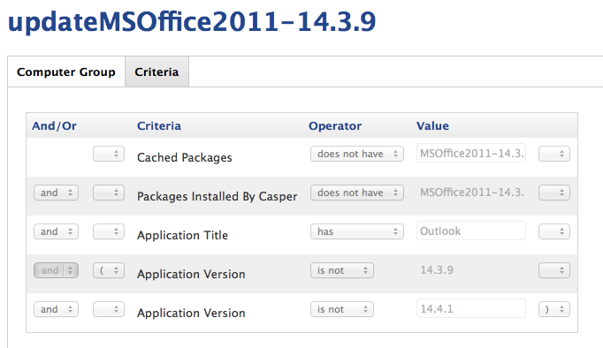
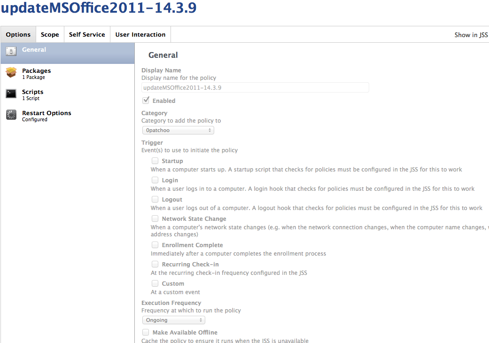
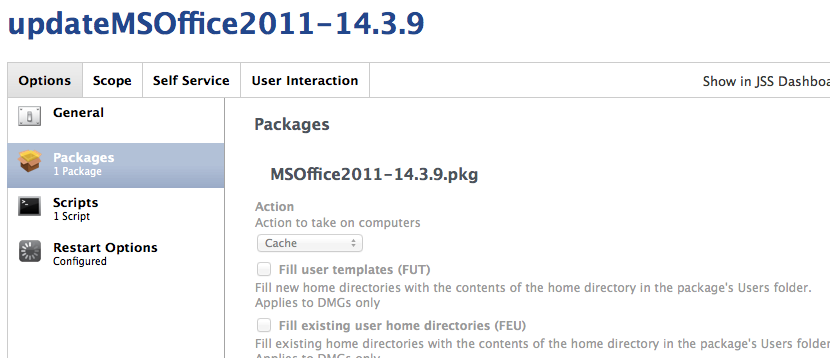
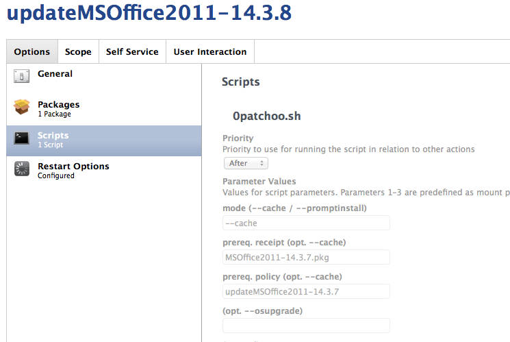
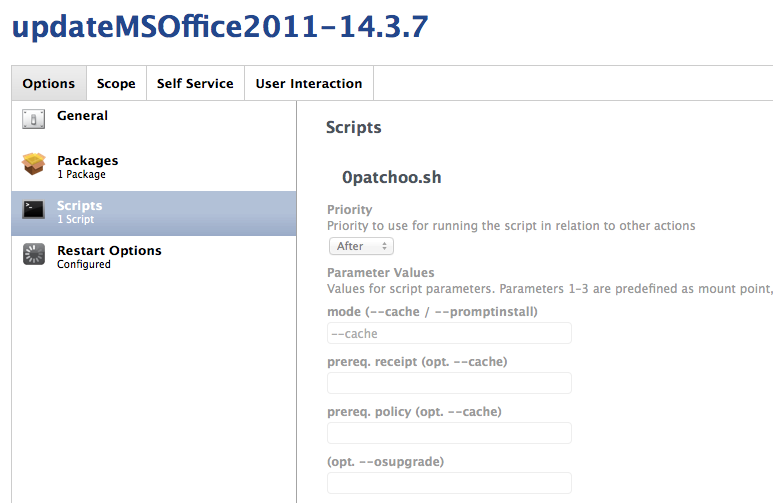
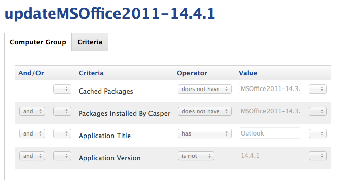
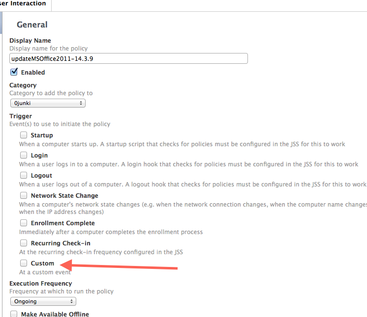
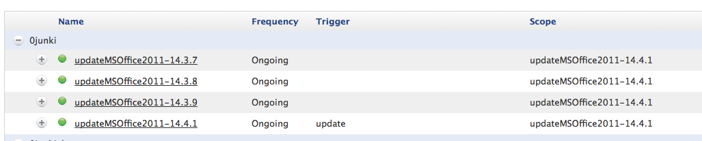

Deploying Chained Incremental Patches
-------------------------------------

Combo and "drag and drop" installations are easy, but what happens when our friends at Microsoft release Office Updaters that have pre-requisite versions and update installer pkgs that must be installed in order?

junki to the rescue! The method is a little crude but it works rather well.

If you supply a pre-requisite pkg, and a pre-requisite policy name, if junki.sh can't find a receipt for the pre-requisite pkgs, it will launch the policy directly, and so on.. the policies can be chained together via this method.

It's not foolproof, if installations or updates were perform outside of Casper, it will attempt to update incorrectly, but generally the updater pkgs will contain scripts and fail out if a required version is not found.

Let's look at the Office 2011 example.

I'd like to patch a range of computers up to `14.3.9`. The last *combo* updater released by Microsoft was `14.3.7`. It will patch all versions from `14.1.0` up to `14.3.7`. We don't have any Macs running `< 14.1.0` so `14.3.7` can be the end of our patch chain.

In the screenshot below we can see `production` Office patches to `14.3.9`, and version `14.4.1` is in `beta`.

Again, we create a smart group to capture our unpatched and uncached Macs.

Name: `updateMSOffice2011-14.3.9`

You will notice in this smart group we've also set critera so that Macs that already have been patched to 14.4.1  (via other methods) aren't included either. Perhaps you have some users that have full admin access and can patch themselves. This is important **or Macs running 14.4.1 could have the 14.3.9 patch cached as well.** 

You will also note that's it's not necessary to scope for each version. Scoping for your *highest* version is sufficient. Only the highest version is actually linked to a trigger (see the first screenshot). The rest of the policies are called internally by junki.sh.

Create a Policy as you did before

The **General** and **Packages** are the same as the [for standalone installers](deploying_standalone_Installers.md)

### Script

You will note that in this case, we are telling junki that there is a pre-requsite installation of `MSOffice2011-14.3.8.pkg` in order to install `14.3.9`. If that's not found, junki will execute the policy `updateMSOffice2011-14.3.8` to install it.

The same goes for `14.3.8`

BUT, as `14.3.7` is at the end of the chain, it doesn't have a prerequisite. 

___

Done! If a Mac doesn't have patches required, using this method you can use OOTB update incremental packages and deploy them in order, with little effort and intelligently!

___

## How do I install the new version?

For this example, MS Office 2011 `14.4.1` as in beta. Moving it into production can be done like this.

### Edit Smart Group

First of all, as your pkgs are scoped to the `updateMSOffice2011-14.3.9`, you'll need to change this to 14.4.1.
Simply change the name to `updateMSOffice2011-14.4.1`, and remove the  `14.3.9` criteria.

### Edit your Policies

Next, edit your current production policy `updateMSOffice2011-14.3.9`.

You need to remove the custom trigger, and leave it so it's enabled, but not set to ANY trigger. (remember: it still may be executed by Macs that require it, but only manually called by junki.sh.)

Next, edit your new production policy `updateMSOffice2011-14.4.1`

Move it into the production category, and change the custom trigger to `update`.

Change the scoped smart group from the `updateMSOffice2011-14.4.1-beta` to the `updateMSOffice2011-14.4.1` smart group you've just edited.

You can then delete the beta smart group, or edit for the new version.

When done your MSOffice policies should look likes this!

### Update Session Summary

Any Macs that are currently that `<14.4.1` will fall into the `updateMSOffice2011-14.4.1`.

A Mac at version 14.2.5 during the update session would:

1. run policy `updateMSOffice2011-14.4.1`
2. `MSOffice2011-14.4.1.pkg` would cache
3. junki.sh would see prerequisite `MSOffice2011-14.3.9.pkg` wasn't installed
4. junki.sh would call policy `updateMSOffice2011-14.3.9`
5. policy `updateMSOffice2011-14.3.9` would cache `MSOffice2011-14.3.9.pkg`
6. junki.sh would see prerequisite `MSOffice2011-14.3.8.pkg` wasn't installed
7. junki.sh would call policy `updateMSOffice2011-14.3.8`
8. policy `updateMSOffice2011-14.3.8` would cache `MSOffice2011-14.3.8.pkg`
9. .....

You get the idea.

On installation, junki will then install all patches in order and no matter what version the clients are currently, they will be brought up to your production version `14.4.1`.

