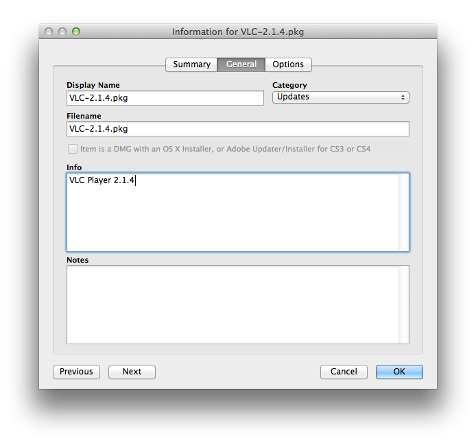

Deploying Software via Casper Policies
======================================

A key feature of patchoo (like munki) is that it unifies the deployment of both Apple and 3rd party software installations and patches. Not having different notifications and dialogs for software patches is better from a user experience perspective, and it builds trust that software deployed is vetted by IT.

Deploying software via patchoo is probably quite similar to the way you've been deploying 3rd party patches without patchoo. With patchoo just add in a script that runs after your pkg cache, and utilise a workflow around testing and beta groups (cool!).

This section will explain the workflow. It's more involved, as Apple aren't providing you with packages, and a logic around what should be installed.

### Upload your pkg into Casper Admin

If you aren't using AutoPKG, I suggest you start. It does all the heavy lifting and can automate pkg creation. Why repackage stuff with Composer unless you really have to?

I do suggest you follow AutoPKG's naming convention for your packages.

`AppName-xxx.pkg`

When you start [deploying chained incremental patches](deploying_chained_incremental_patches.md), it's important that you are following a good naming convention. It will make you life much easier.

### Give your pkg a friendly name

The last thing we want our users seeing is an ugly name like `MSOffice2011-14.4.1.pkg`. Whilst it's not the end of the world, it's nice to have a friendly name pop up in the user facing GUI.

Once you've uploaded your package, Get info on it and go to the General tab.

Fill in the Info field with something nice.

### Set Priority

patchoo also respects the priority of pkgs when it deciphers the installation order (you can leave at default 10). For drag and drop installations, this is not important, but if you are installing incremental updates it's important you set the priority and don't leave it update to alphabetical sorting (which *could* work).

Priority  | Pkg
--------- | ------------- 
10        | MSOffice2011-14.2.0.pkg
11        | MSOffice2011-14.3.7.pkg
12        | MSOffice2011-14.4.1.pkg

This will ensure if they are installed at once they are applied in order. 

