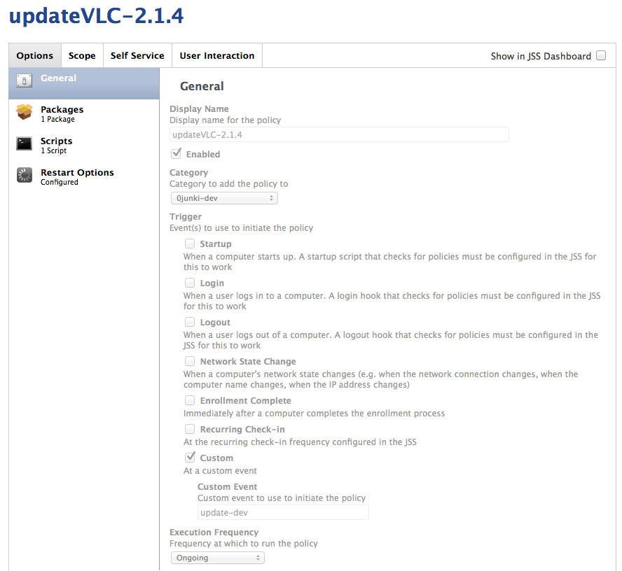
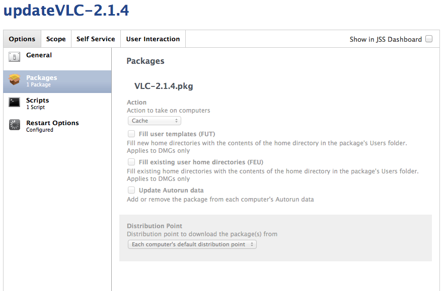
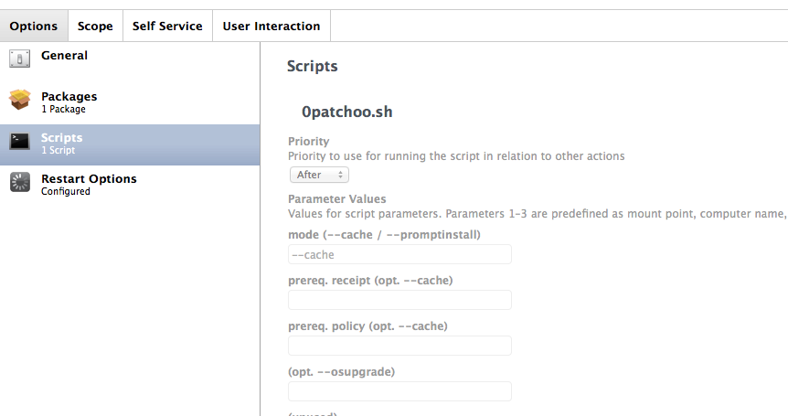
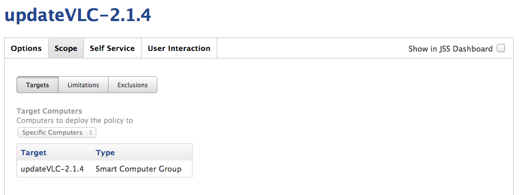
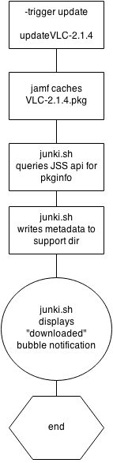

Deploying Standalone or Drag and Drop Installers
------------------------------------------------

Now you have a [smart group](scoping_software_deployment_smart_groups.md) for this application update, we'll go on to how to setup a policy to cache the update.

Drag and drop installation or standalone/combo updaters are easy, as they don't require a preexisting version or update be installed. Fear not though [junki can handle incrementals too!](deploying_chained_incremental_patches.md)

We'll follow on from our VLC example in the smart group.

In this example we will assume you are using junki advanced, and software deployment groups. This patch will first of all be deployed to our dev / testing group.

If you were deploying to production computers, you would just ensure that it's linked to the `update` trigger, but we'll go into that workflow in more detail later.

Create a new policy as follows:

#### General tab

* Name: `updateVLC-2.1.4`
* Enabled: `true`
* Category: `0-junki-dev`
* Trigger: `update-dev`
* Execution: `ongoing`

#### Package Tab

* Pkg: `VLC-2.1.4.pkg`
* Action: `Cache`  ***IMPORTANT***
* FUT / FEU (up to you!)

It's important that the package is **cached**. Junki will notify the user and perform the installation later.

#### Script tab

* Script: `0junki.sh`
* Priority: `after` ***IMPORTANT***
* Mode (1st param): `--cache`
* (opt. --forceinstall / --osupgrade): `''` ***IMPORTANT:***  *as of the time of writing, Casper 9.x has a bug (D-005830) with passing script parameters. Even though this is optional, put in 2x single quotes to prevent this parameter from being empty*
* pkg descript: `VLC Media Player 2.1.4` *this is the friendly name of this pkg for the GUI*
* pkg filename: `VLC-2.1.4.pkg` *it's important that junki can match up your metadata with the cached pkg*

#### Scope / Targets tab

* Computer Group: `updateVLC-2.1.4`

This is the group you created in the [previous secton](scoping_software_deployment_smart_groups.md)

___

   
Overview of Junki ---cache Policy Execution
-------------------------------------------
   
   

