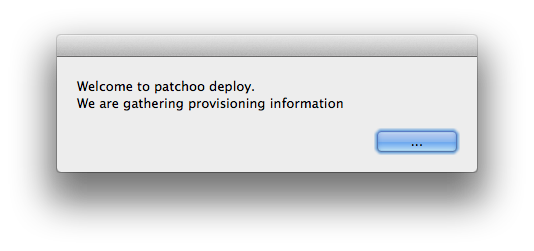
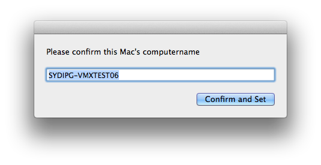
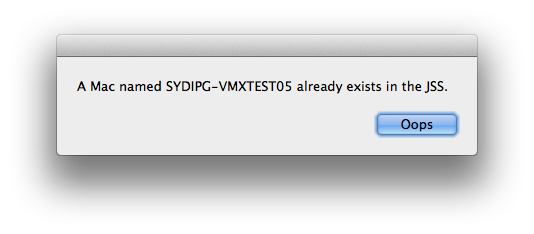
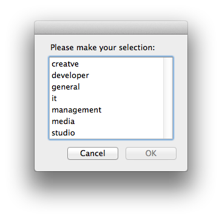
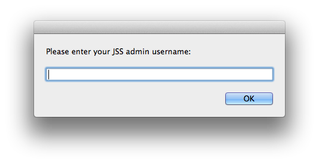
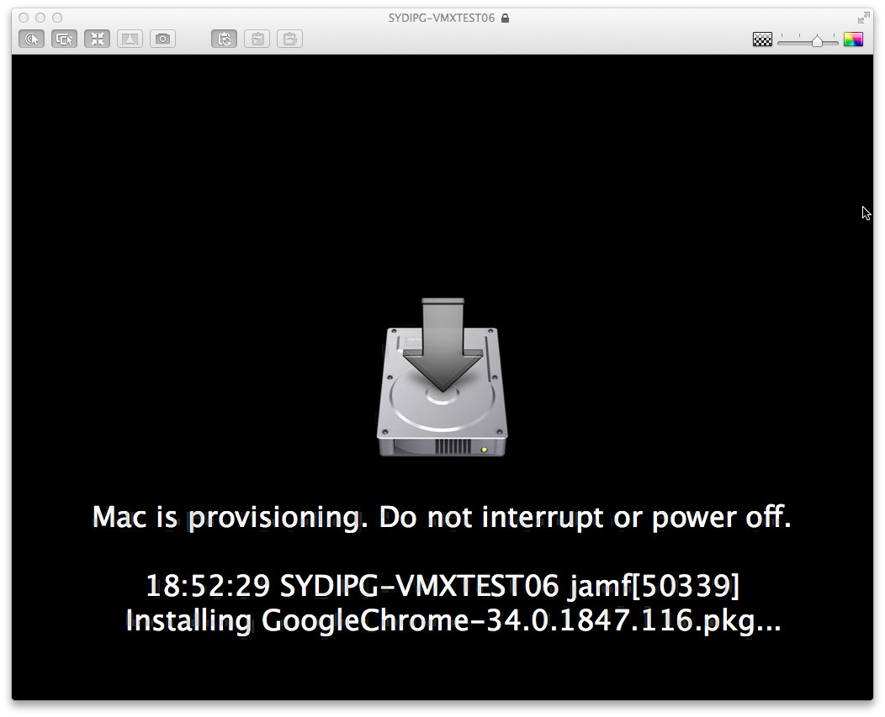

Patchoo Deploy Overview
-----------------------

### Introduction ###

Patchoo Deploy provides a framework for deployment and provisioning of new or re-imaged Macs.

As Casper admins are moving from an "image" based deployment workflows to policy based "thin provisioning" over the top of a factory Apple build, or a vanilla AutoDMGed Mac, PD aims to provide with the following:

* GUI for prompting for provisioning info
* JSS api read/write of provisioning info
* GUI / loginwindow lock during deployment
* allow Macs to be re-deployed / imaged, and base builds on persistent JSS data, rather than fake pkg receipts.

It supports a number of workflows

1. Mac OOTB
2. Setup Assistant
3. QuickAdd enroled via user or admin
4. User or admin can be prompted for the following provisioning information:
	* ComputerName
	* Custom Patchoo "Build" extension attribute (this can be used to scope, and fires a custom deploy-xxx trigger)
	* Department
	* Building
5. The JSS has provision details written.
6. A launchagent and bootstraphelper  is written to drive the "bootstrap" process.
7. The Mac restarts
8. Bootstrap starts a loginwindow, the screen is locked.
9. Mac pulls provision information from the JSS.
10. Bootstraphelper fires -trigger deploy
11. All policies scoped to this trigger are run (scope geographic or department specific in this way).
12. Bootstraphelper fires -trigger deploy-xxxx (xxx being your build intentifier stored in the JSS ext attrib) - scope build specific policies.
13. Deploy process is finished.
14. Mac restarts and starts update loop.
15. A patchoo update session loops until Mac is fully patched.
16. Loginwindow unlocks.

You can levearge, all some or none of the provisioning details. You can support admin or enduser enrolment and provisioning. Macs that are imaged via Casper Imaging and don't have provisioning formation go in to a "holdingpattern", touch a receipt, recon and you can scope a smart group to catch and notify administrators.

#### Example Screenshots ####

On enrollment complete trigger.

Prompted to confirm and set computername

The JSS is checked for an existing computername.

The Patchoo Build EA is read, and prompted for.

If no API user with write access is provided, an admin can set the details.

Once done, the Mac restarts. Provision looks like this (the jamf log is tailed and displayed on a 3 sec interval)

If a Mac is enroled via a non-interactive method (Casper Imaging / Recon network scans) or prompt for info is disabled... the Mac may have no provisioning info. The holdingpattern is displayed, and the JSS is queried every 2 minutes.

