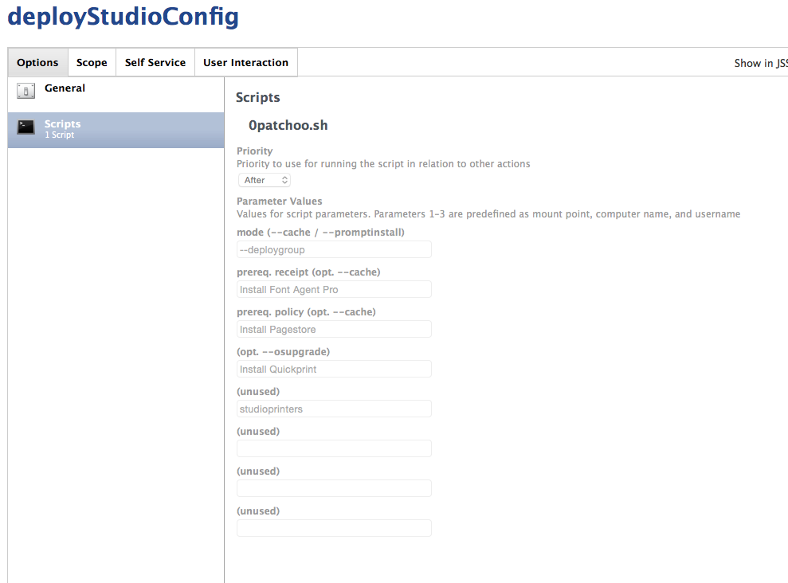

Using Patchoo Deploy Groups
===========================

To group a bunch of policies together, or execute a self service policy in your deployment workflow, deploygroups can help out.

An example usage could be:

You have a policy called `Install Google Chrome` that is setup self service. You'd also like it deployed to certain computers.

You can create a deployGoogleChrome policy that installs the pkg and scope accordingly, but each time you update the pkg, you need to adjust two policies.

By utilising the `--deploygroup` functionality you can have your deploy policy call the Self Service policy. Then only one policy must be updated.

`--deploygroup` mode lets you call up to 7 policies OR triggers in order. It could help cutdown on the number of deploy policies you require for your builds, but remember striking balance between granularity and simplifying and dumping a lot stuff together can be tricky depending on your environment.

** NOTE: As of Casper 9.4 there is a bug that means the values in slot 10 & 11 aren't passed correctly. Don't use them until this is fixed. https://jamfnation.jamfsoftware.com/discussion.html?id=11906 **

Pass either full policy names, or triggers, patchoo.sh will first query the JSS for an existing policy name, and call it, or if one doesn't exist it assumes you the value is a trigger.

eg. screenshot

