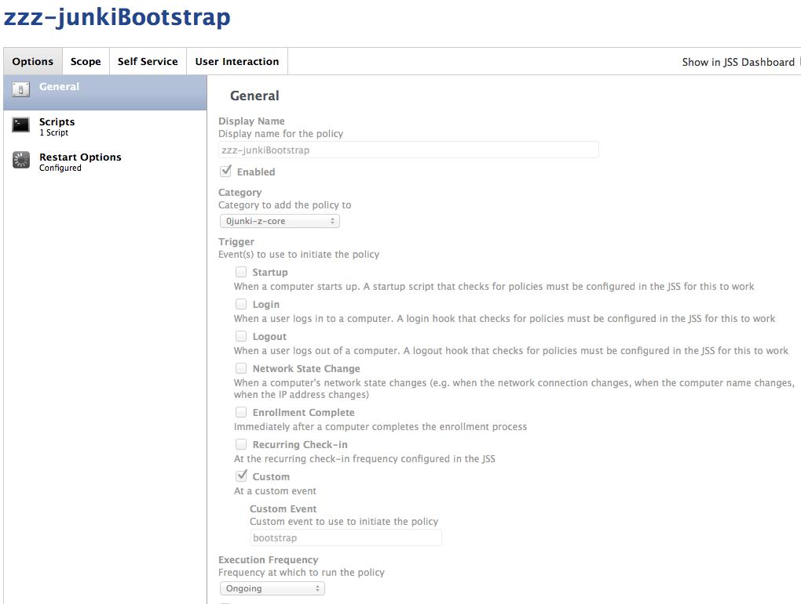
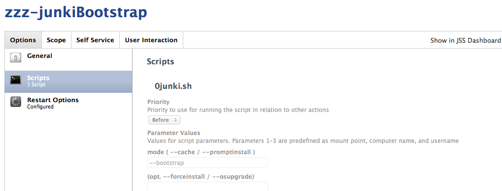
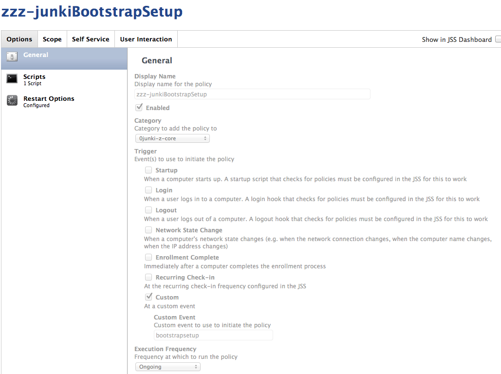
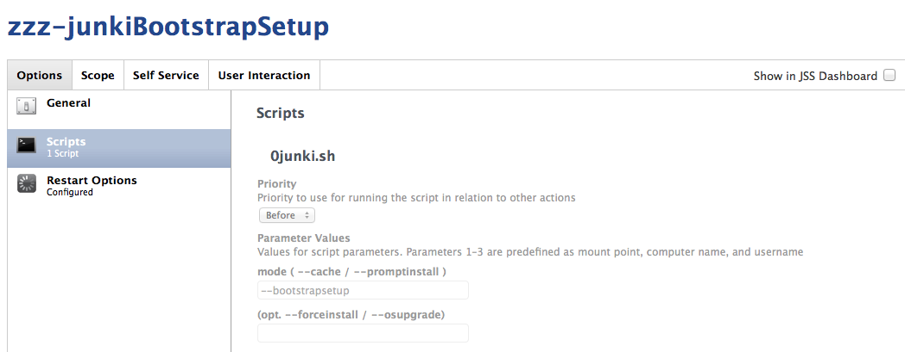

Setup Bootstrap Policies
------------------------

### zzz-patchooBootstrap

*** THIS POLICY IS REQUIRED FOR PATCHOO DEPLOY ***

patchooBootstrap actually drives the bootstrap process. It is called by the local `patchoo.sh --bootstraphelper` (the process responsible for locking the loginwindown and providing local GUI). It handles patchoo deploy and runs an update loop to ensure all patches are installed.

Scope: `allClients`

___

### zzz-patchooBootstrapSetup

*** BOOTSTRAP SETUP ISN'T REQUIRED IF USING PATCHOO DEPLOY, DEPLOYSETUP CALLS THIS FUNCTION INTERNALLY ***

patchooBootstrapSetup is used post a Casper Imaging, or anytime you'd like to bring a non-compliant client to parity with your current patch release cycles.

It calls `0patchoo.sh --bootstrapsetup` which copies patchoo.sh to the local disk, writes out a launchagent that runs at loginwindow and runs `patchoo.sh --bootstraphelper`. Bootstraphelper, locks the loginwindow, provides GUI feedback (via jamfhelper bin fullscreen) and then fires a bootstrap loop.

Scope: `allClients`

___
