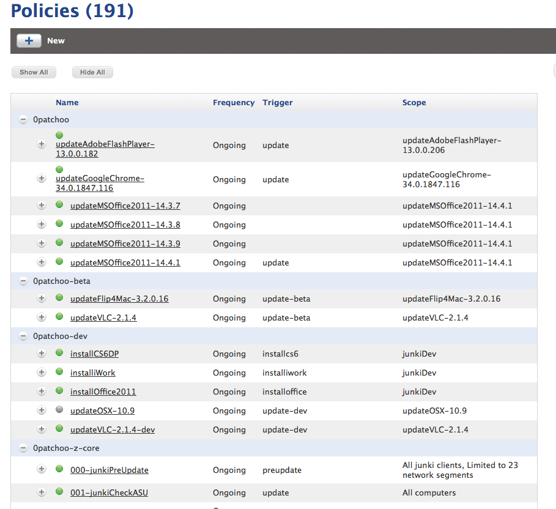

Setup Categories
----------------

Creating categories within your JSS will help organise your policies, and if using [junki Advanced mode](advanced_junki_overview.md) it will give you a good visual representation of which package deployments are in dev, beta, and production.

As with the 0junki.sh script, naming your categories with preceeding 0's will mean they sort alphabetically.

The suggested categories are:

* 0junki - *for software updates in production*
* 0junki-beta - *for software updates in beta*
* 0junki-dev - *for software updates in dev/testing*
* 0junki-z-core - *for the junki's core policies that drive the process*

If you aren't using [junki Advanced mode](advanced_junki_overview.md) you can skip setting up the dev and beta categories.

Click:

* Settings
* Computer Management
* Categories
* New 

Create your categories. To give you an idea of how your categories will be presented within the JSS when in use, here's an example screenshot.

