Setup Core Policies
-------------------
The following policies are the core of junki. They drive the caching, Apple Software Update, installation, logout, user prompts and installation reminders.

It's recommended that you create a [category](setup_categories.md) to house them within your JSS.

* [junkiPreUpdate](#junkiPreUpdate)
* [junkiCheckASU](#junkiCheckASU)
* [junkiPromptToInstall](#junkiPromptToInstall)
* [junkiPromptAndInstallAtLogout](#junkiPromptAndInstallAtLogout)
* [junkiStartup](#junkiStartup)
* [junkiUpdateRemindPrompt](#junkiUpdateRemindPrompt)

___
### [000-junkiPreUpdate](id:junkiPreUpdate)

*optional for [junki advanced mode](advanced_junki_overview.md)*  

If using [junki advanced mode](advanced_junki_overview.md) you can utilise the preudpate policy, fired by the [preudpate trigger](install_triggers.md). By using a preupdate policy, you can enforce limitations (network segments, time of day etc) so updates are not triggers on certain WAN or VPN connections.

The preupdate policy queries the [JSS via the api](setup_jss_api_access.md) and checks if the client is a member of the any of the [deployment groups](setup_computer_deployment_groups.md) (*dev / beta / production / etc*). If found it fires the relevant trigger (*eg. update-beta*) before firing the default *update* trigger.

Using this method allows us to allocate different software installations based on JSS group membership. This is great for a *dev / beta / production* similar to munki's catalogs.

#### General tab

* Name: `000-junki-PreUpdate`
* Enabled: `true`
* Category: `0-junki-z-core`
* Trigger: `preudpate`
* Execution: `ongoing`

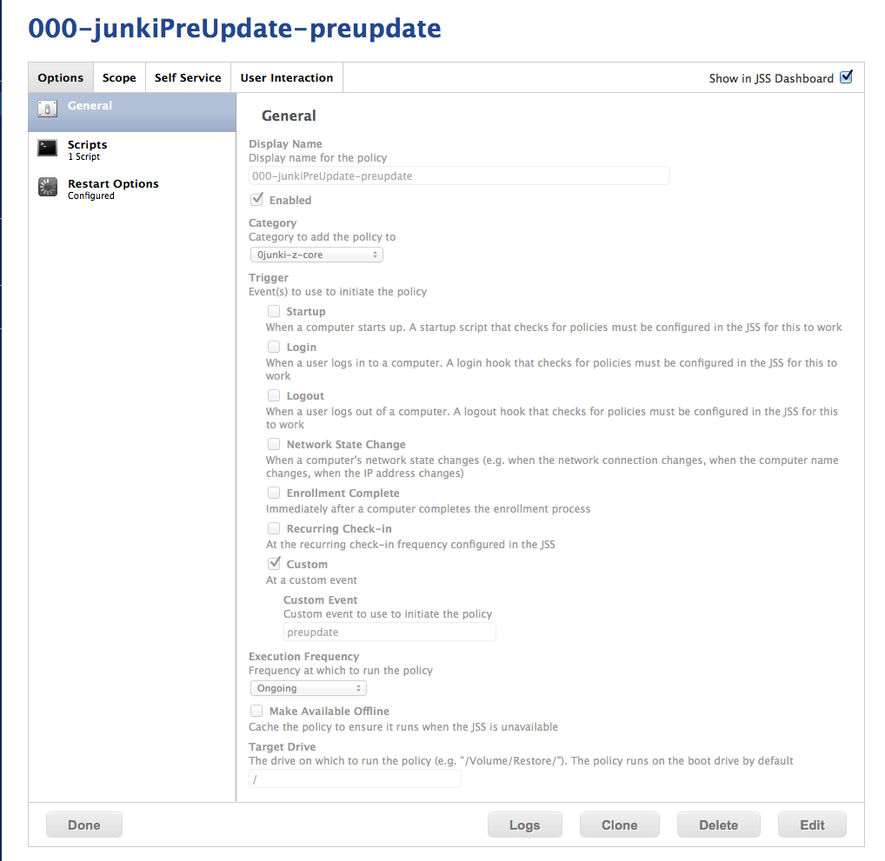

#### Script tab

* Script: `0junki.sh`
* Priority: `before`
* Mode (1st param): `--preupdate`

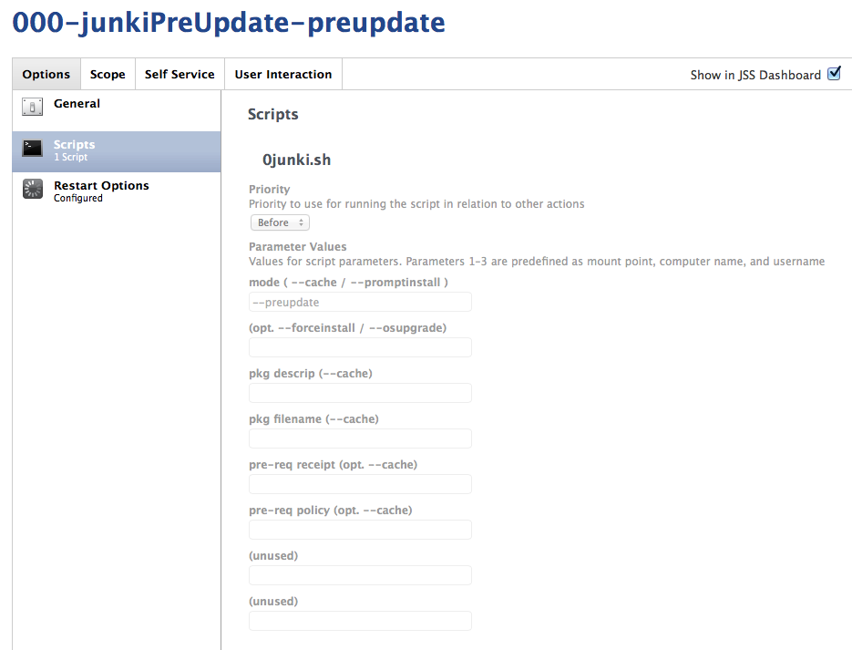

#### Scope / Targets tab

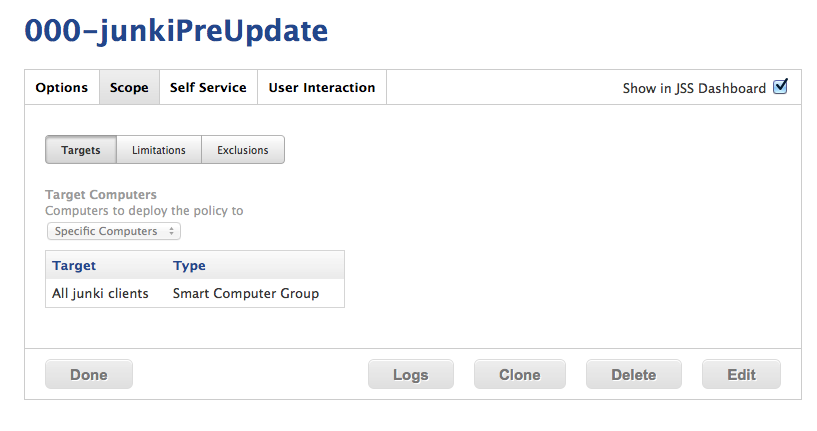

You can limit computers via group here any way you desire, or you can ensure that only clients that are junki capable (ie. have CocoaDialog installed).

* Computer Group: `allJunkiClients`

#### Scope / Limitations

You can limit your junki sessions via Network Segment, or times here. This can prevent your clients from attempting to pull updates whilst on the VPN or on a poor WiFi / WAN segment. In this example screenshot we add all of our high speed connects, and ensure that clients on the VPN IP range don't fire an update session.

Since the preupdate policy calls the rest of the update chain, you can perform all of your scope limitations to this policy, rather than scoping each and every software deployment policy. Clever!

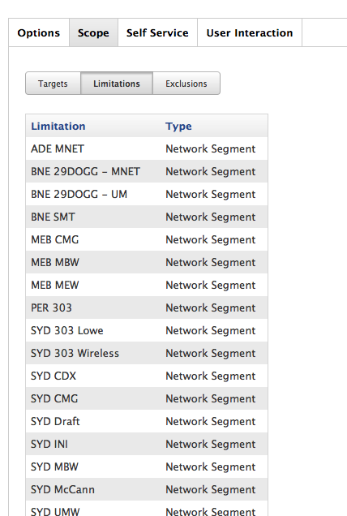
     
      
___
### [001-junkiCheckASU](id:junkiCheckASU)

junkiCheckASU calls `0junki.sh --checkasu` which does the following:

* If using [junki advanced mode](advanced_junki_overview.md) it checks group membership, if the computer is a member of the one of the [deployment groups](setup_computer_deployment_groups.md), `--checkASU` will take the existing Apple Software Update CatalogURL, prune catalog path and re-write URL to point at a reposado fork dynamically. This allows you to direct Macs at beta, dev and production update catalog forks.
* It then downloads and caches all available Apple Software Updates, presenting a notification bubble.

#### General tab

* Name: `001-junkiCheckASU`
* Enabled: `true`
* Category: `0-junki-z-core`
* Trigger: `update`
* Execution: `ongoing`

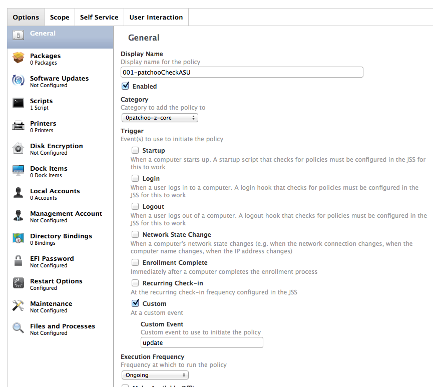

#### Script tab
 
* Script: `0junki.sh`
* Priority: `before`
* Mode (1st param): `--checkasu`

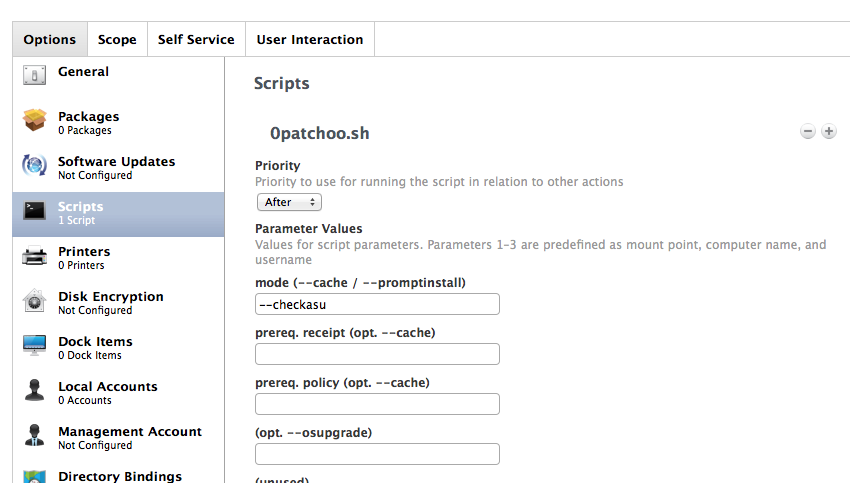

#### Scope tab

* Computer Group: `allJunkiClients`

___
### [zzz-junkiPromptToInstall](id:junkiPromptToInstall)

This policy is called at the end of an update chain. If [software deployment policies](deploying_standalone_Installers.md) have cached any installations, or [junkiCheckASU](#junkiCheckASU) has downloaded Apple Software Updates (or any are waiting there any any cached from previous sessions) this policy will prompt the user to start the installation.

As it MUST be called at the end of an update chain, it's important that's named `zzz-....`. See the [overview](overview.md) for clarification of an update session.

#### General tab

* Name: `zzz-junkiPromptToInstall`
* Enabled: `true`
* Category: `0-junki-z-core`
* Trigger: `update`
* Execution: `ongoing`

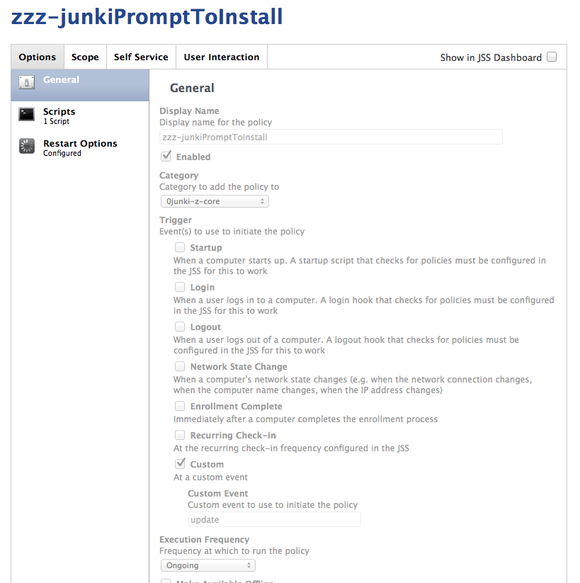

#### Script tab

* Script: `0junki.sh`
* Priority: `before`
* Mode (1st param): `--promptinstall`

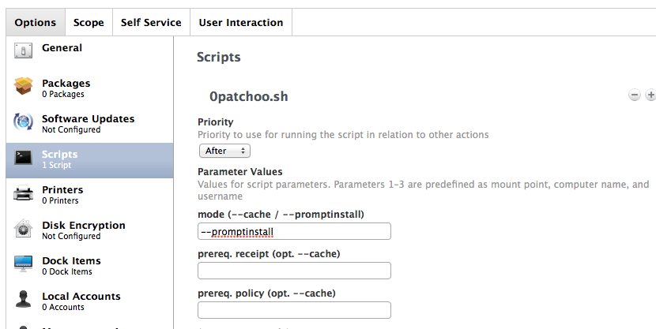

#### Scope tab

* Computer Group: `allJunkiClients`

___
### [zzz-junkiPromptAndInstallAtLogout](id:junkiPromptAndInstallAtLogout)

This policy is one that does the heavy lifting when it comes to actual installation. If an update session has been triggered by the [junkiPromptToInstall](#junkiPromptToInstall) this policy runs the installations.

If the user is logging out and there are available updates, this policy also prompts to ask the user if they would like to install.

#### General tab

* Name: `zzz-junkiPromptAndInstallAtLogout`
* Enabled: `true`
* Category: `0-junki-z-core`
* Trigger: `logout`
* Execution: `ongoing`

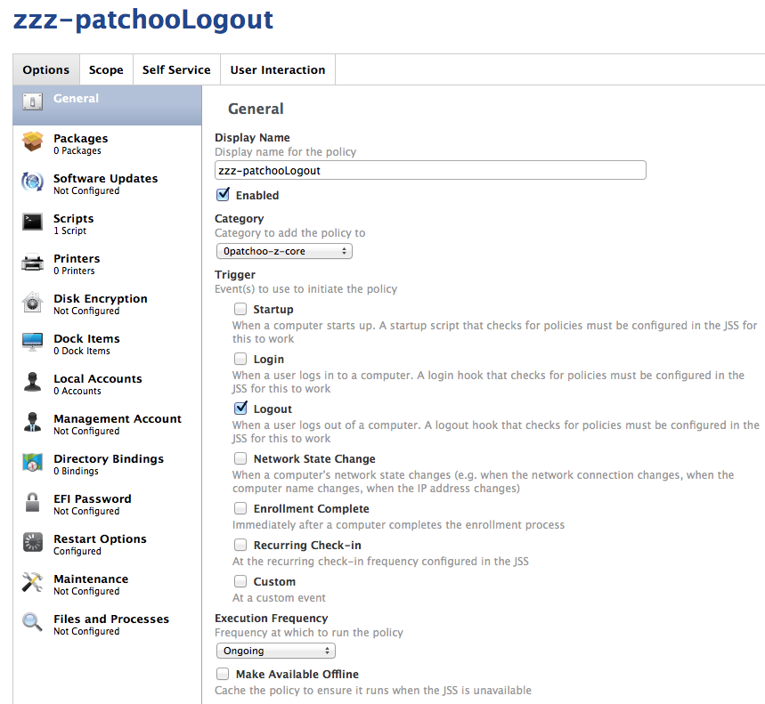

#### Script tab

* Script: `0junki.sh`
* Priority: `before`
* Mode (1st param): `--logout`

#### Scope tab

* Computer Group: `allJunkiClients`

___
### [zzz-junkiStartup](id:junkiStartup)

junkiStartup is responsible for any startup housekeeping. Currently this is limited to running a recon, post installation reboot.

#### General tab

* Name: `zzz-junkiStartup`
* Enabled: `true`
* Category: `0-junki-z-core`
* Trigger: `startup`
* Execution: `ongoing`

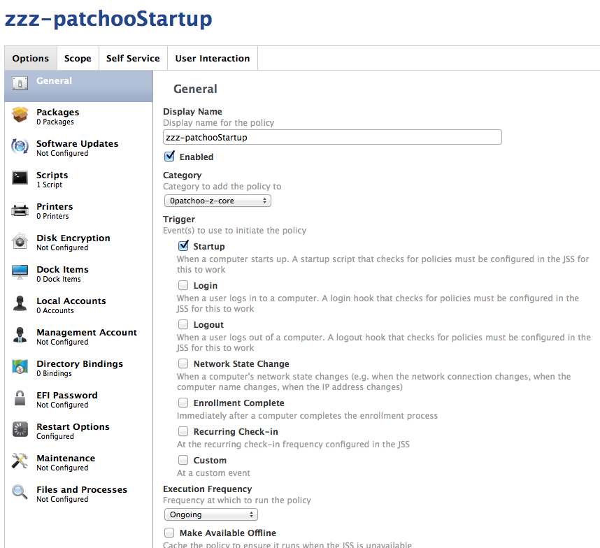

#### Script tab

* Script: `0junki.sh`
* Priority: `before`
* Mode (1st param): `--startup`

#### Scope tab

* Computer Group: `allJunkiClients`

___
### [zzz-junkiUpdateRemindPrompt](id:junkiUpdateRemindPrompt)

junkiUpdateRemindPrompt as the name implies reminds users that have cached installations waiting. By scoping junkiUpdateRemindPrompt to [junkiInstallsWaiting](setup_smart_groups.md) smartgroup, you can limit unnecessary executions.

This policy will also catch any prompts that are missed due to blocking apps, screensaver, no-logins or timeouts. If a prompt is missed, this policy every 120 min (default) will prompt again.

#### General tab

* Name: `zzz-junkiUpdateRemindPrompt`
* Enabled: `true`
* Category: `0-junki-z-core`
* Trigger: `every120`
* Execution: `ongoing`

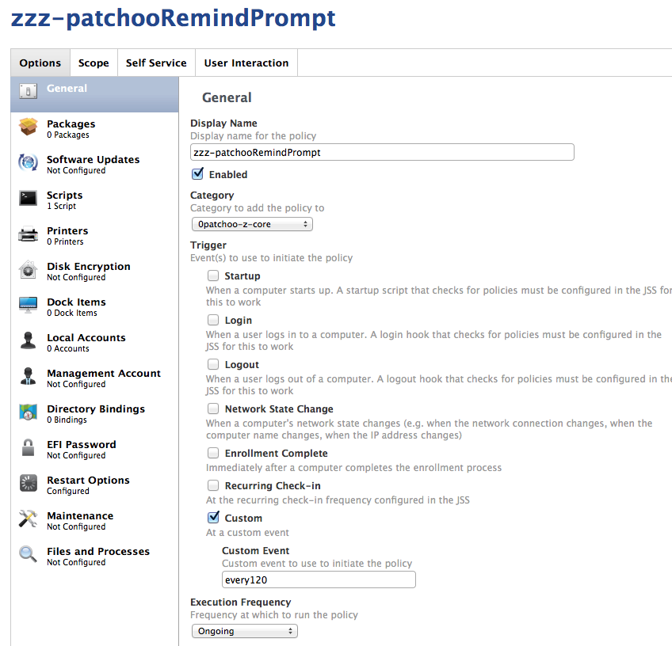

#### Script tab

* Script: `0junki.sh`
* Priority: `before`
* Mode (1st param): `--remind`

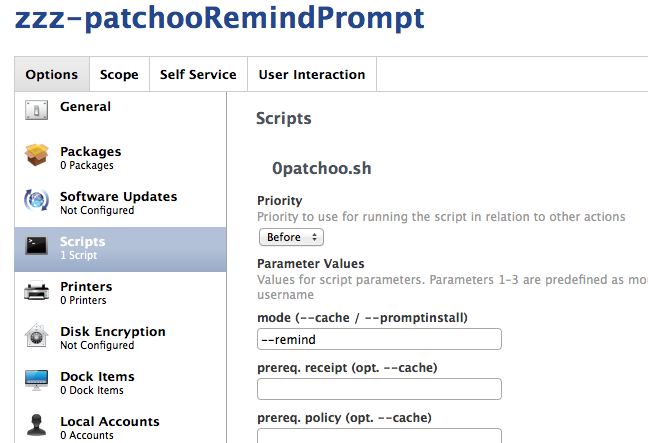

#### Scope tab

* Computer Group: `updateJunkiInstallsWaiting`

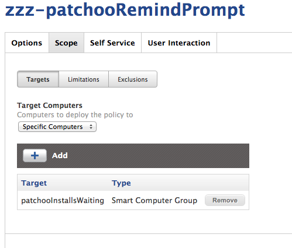

___

Well done!
----------

You are almost there now. The core of junki is setup! Your core policies should look something like this.

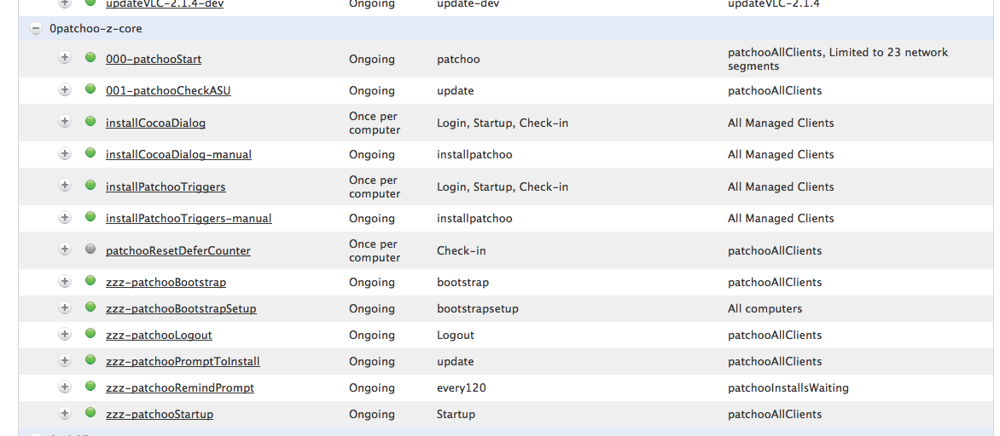
