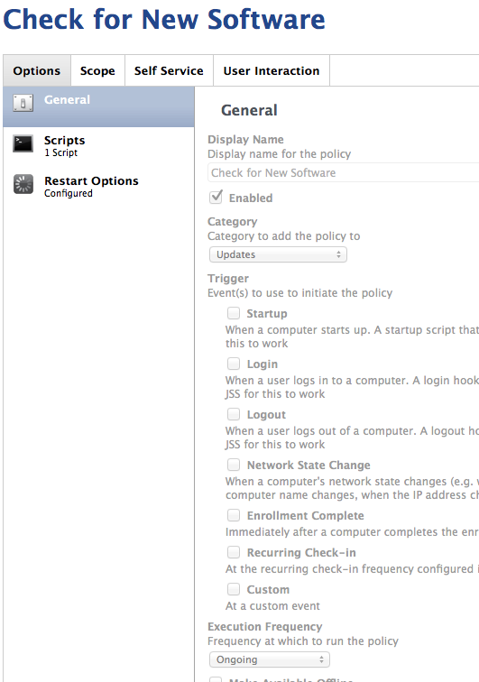
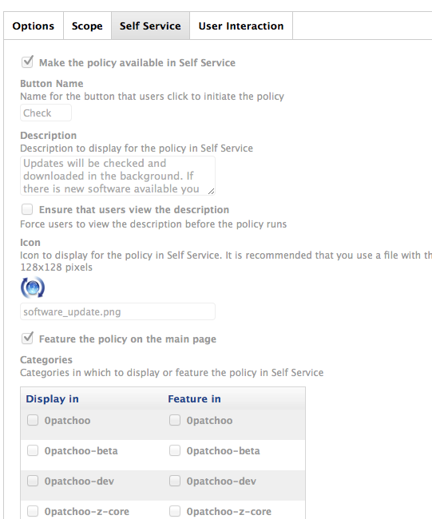
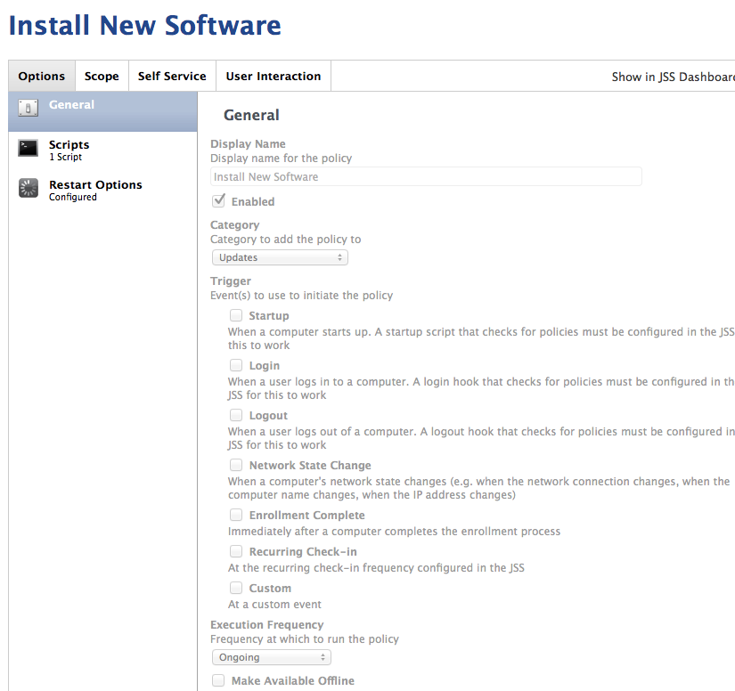
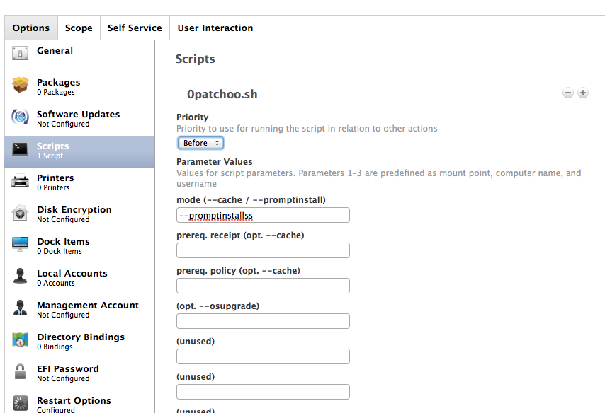
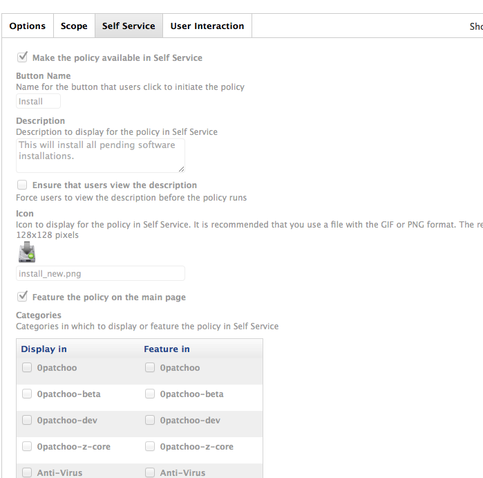

Setup Core Policies
-------------------
The following policies are the core of patchoo. They drive the caching, Apple Software Update, installation, logout, user prompts and installation reminders.

It's recommended that you create a [category](setup_categories.md) to house them within your JSS.
## Core

* [patchooStart](#patchooStart)
* [patchooCheckASU](#patchooCheckASU)
* [patchooPromptToInstall](#patchooPromptToInstall)
* [patchooPromptAndInstallAtLogout](#patchooPromptAndInstallAtLogout)
* [patchooStartup](#patchooStartup)
* [patchooUpdateRemindPrompt](#patchooUpdateRemindPrompt)

___
## Self Service
* [Check for New Software](#ssCheck)
* [Install New Software](#ssInstall)

___
### [000-patchooStart](id:patchooStart)

The patchooStart policy fired by the [patchoo trigger](install_triggers.md). By using a preupdate policy, you can enforce limitations (network segments, time of day etc) so updates are not triggers on certain WAN or VPN connections.

The preupdate policy queries the [JSS via the api](setup_jss_api_access.md) and checks if the client is a member of the any of the [deployment groups](setup_computer_deployment_groups.md) (*dev / beta / production / etc*). If found it fires the relevant trigger (*eg. update-beta*) before firing the default *update* trigger.

Using this method allows us to allocate different software installations based on JSS group membership. This is great for a *dev / beta / production* similar to munki's catalogs.

#### General tab

* Name: `000-patchooStart`
* Enabled: `true`
* Category: `0-patchoo-z-core`
* Trigger: `patchoo`
* Execution: `ongoing`

#### Script tab

* Script: `0patchoo.sh`
* Priority: `before`
* Mode (1st param): `--patchoostart`

#### Scope / Targets tab

Since the patchooStart policy calls the rest of the update chain, you can perform all of your scope limitations to this policy, rather than scoping each and every software deployment policy. Clever!

* Computer Group: `patchooAllClients` or `any other smart Group`

#### Scope / Limitations

You can limit your patchoo sessions via Network Segment, or times here. This can prevent your clients from attempting to pull updates whilst on the VPN or on a poor WiFi / WAN segment. In this example screenshot we add all of our high speed connects, and ensure that clients on the VPN IP range don't fire an update session.

     
      
___
### [001-patchooCheckASU](id:patchooCheckASU)

patchooCheckASU calls `0patchoo.sh --checkasu` which does the following:

* If using [patchoo advanced mode](advanced_patchoo_overview.md) it checks group membership, if the computer is a member of the one of the [deployment groups](setup_computer_deployment_groups.md), `--checkASU` will take the existing Apple Software Update CatalogURL, prune catalog path and re-write URL to point at a reposado fork dynamically. This allows you to direct Macs at beta, dev and production update catalog forks.
* It then downloads and caches all available Apple Software Updates, presenting a notification bubble.

#### General tab

* Name: `001-patchooCheckASU`
* Enabled: `true`
* Category: `0-patchoo-z-core`
* Trigger: `update`
* Execution: `ongoing`

#### Script tab
 
* Script: `0patchoo.sh`
* Priority: `before`
* Mode (1st param): `--checkasu`

#### Scope tab

* Target Computers `patchooAllClients`

___
### [zzz-patchooPromptToInstall](id:patchooPromptToInstall)

This policy is called at the end of an update chain. If [software deployment policies](deploying_standalone_Installers.md) have cached any installations, or [patchooCheckASU](#patchooCheckASU) has downloaded Apple Software Updates (or any are waiting there any any cached from previous sessions) this policy will prompt the user to start the installation.

As it MUST be called at the end of an update chain, it's important that's named `zzz-....`. See the [overview](overview.md) for clarification of an update session.

#### General tab

* Name: `zzz-patchooPromptToInstall`
* Enabled: `true`
* Category: `0-patchoo-z-core`
* Trigger: `update`
* Execution: `ongoing`

#### Script tab

* Script: `0patchoo.sh`
* Priority: `before`
* Mode (1st param): `--promptinstall`

#### Scope tab

* Target Computers `patchooAllClients`

___
### [zzz-patchooLogout](id:patchooLogout)

This policy is one that does the heavy lifting when it comes to actual installation. If an update session has been triggered by the [patchooPromptToInstall](#patchooPromptToInstall) this policy runs the installations.

If the user is logging out and there are available updates, this policy also prompts to ask the user if they would like to install.

#### General tab

* Name: `zzz-patchooLogout`
* Enabled: `true`
* Category: `0-patchoo-z-core`
* Trigger: `logout`
* Execution: `ongoing`

#### Script tab

* Script: `0patchoo.sh`
* Priority: `before`
* Mode (1st param): `--logout`

#### Scope tab

* Target Computers `patchooAllClients`

___
### [zzz-patchooStartup](id:patchooStartup)

patchooStartup is responsible for any startup housekeeping. Currently this is limited to running a recon, post installation reboot.

#### General tab

* Name: `zzz-patchooStartup`
* Enabled: `true`
* Category: `0-patchoo-z-core`
* Trigger: `startup`
* Execution: `ongoing`

#### Script tab

* Script: `0patchoo.sh`
* Priority: `before`
* Mode (1st param): `--startup`

#### Scope tab

* Target Computers `patchooAllClients`

___
### [zzz-patchooRemindPrompt](id:patchooRemindPrompt)

patchooUpdateRemindPrompt as the name implies reminds users that have cached installations waiting. By scoping patchooUpdateRemindPrompt to [patchooInstallsWaiting](setup_smart_groups.md) smartgroup, you can limit unnecessary executions.

This policy will also catch any prompts that are missed due to blocking apps, screensaver, no-logins or timeouts. If a prompt is missed, this policy every 120 min (default) will prompt again.

#### General tab

* Name: `zzz-patchooRemindPrompt`
* Enabled: `true`
* Category: `0-patchoo-z-core`
* Trigger: `every120`
* Execution: `ongoing`

#### Script tab

* Script: `0patchoo.sh`
* Priority: `before`
* Mode (1st param): `--remind`

#### Scope tab

* Computer Group: `patchooInstallsWaiting`

___

## Self Service

These are client facing Self Service Policies, and as such should be named a categorised *nicely*. I'd recommend an Updates category.

Icons are included [here](../extras/ss icons)

### [Check for New Software](id:ssCheck)

#### General tab

* Name: `Check for New Software`
* Enabled: `true`
* Category: `0-patchoo-z-core`
* Trigger: `none`
* Execution: `ongoing`

#### Script tab

* Script: `0patchoo.sh`
* Priority: `before`
* Mode (1st param): `--checkss`

#### Self Service

* Make the policy available in Self Service: `yes`
* Button Name: `Check`
* Description: `Updates will be checked and downloaded in the background. If there is new software available you will be notified.`
* Feature the policy on the main page: `yes` (up to you).

#### Scope tab

* Computer Group: `patchooAllClients`

### [Install New Software](id:ssInstallNewSoftware)

#### General tab

* Name: `Install New Software`
* Enabled: `true`
* Category: `0-patchoo-z-core`
* Trigger: `none`
* Execution: `ongoing`

#### Script tab

* Script: `0patchoo.sh`
* Priority: `before`
* Mode (1st param): `--promptinstallss`

#### Self Service

* Make the policy available in Self Service: `yes`
* Button Name: `Install`
* Description: `This will install all pending software installations.`
* Feature the policy on the main page: `yes` (up to you).

#### Scope tab

(By scoping to the `patchooInstallsWaiting` this policy will only popup on user's Self Service.app when installations are available)

* Computer Group: `patchooInstallsWaiting`

___
___

Well done!
----------

You are almost there now. The core of patchoo is setup! Your core policies should look something like this.

