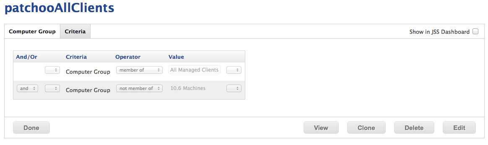

Setup Smart Groups
------------------
patchoo requires some smart groups for core functionality, along with [smart groups to scope software installations](scoping_software_deployment_smart_groups.md).

### patchoAllClients

You can limit the computers that will run patchoo in anyway via this group. Later when we scope our patchooStart policy, we'll scope it to this group. Only computers included in this group will perform update runs.

**Criteria:** Group is `All Managed Clients`
eg. **and is NOT a member of** `10.6 Clients`

In this example since patchoo hasn't be exclusively tested on 10.6, we'll exclude the few 10.6 Macs we have in circulation. Our `All Managed Clients` includes criteria to ensure servers, CDPs and other Macs aren't included.

### patchooInstallsWaiting

**Criteria:** patchoo Installs is *Yes*

This group catches all Macs that have cached installations waiting to be installed.

### patchooDeferCount10+

**Criteria:** patchoo Defer Count *more than x*

This group can catch Macs that are deferring past the threshold (perhaps they are meeting room Macs that are unattended).

It's probably also worthwhile setting an email alert, and having this in the dashboard so you can catch non compliant clients that are slipping through the cracks.

