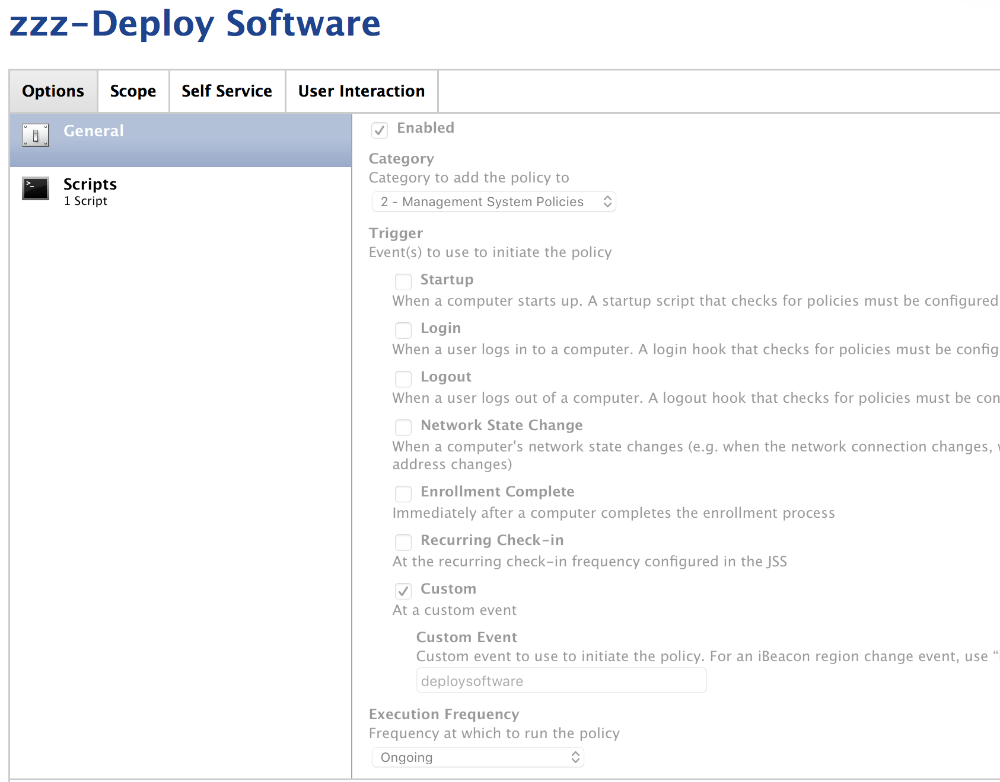
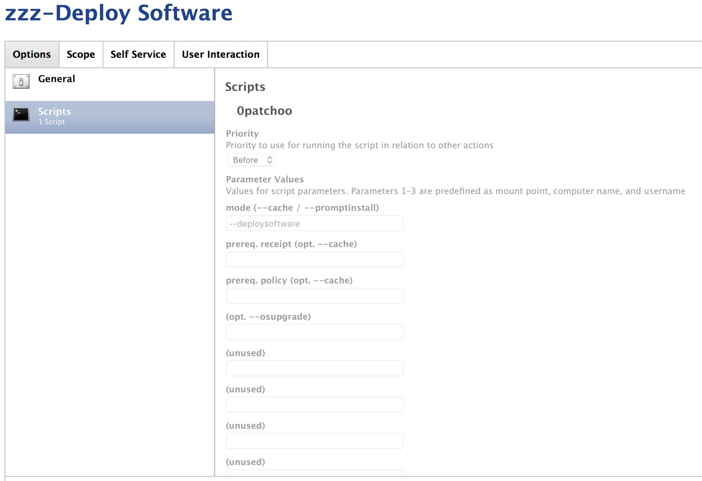

Setup Bootstrap Policies
------------------------

### zzz-Deploy Software

*** THIS POLICY IS REQUIRED FOR PATCHOO DEPLOY ***

Deploy Software actually drives the process. It is called by the local `patchoo.sh --deploysoftware` (the process responsible for locking the screen and providing feedback). It handles patchoo deploy in a way compatible with DEP.

Scope: `allClients`