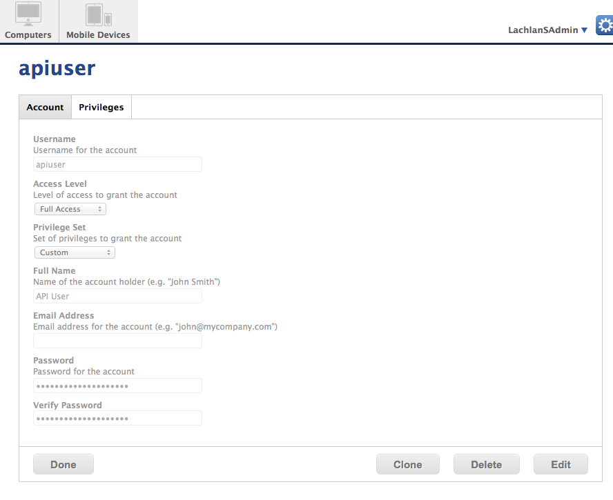
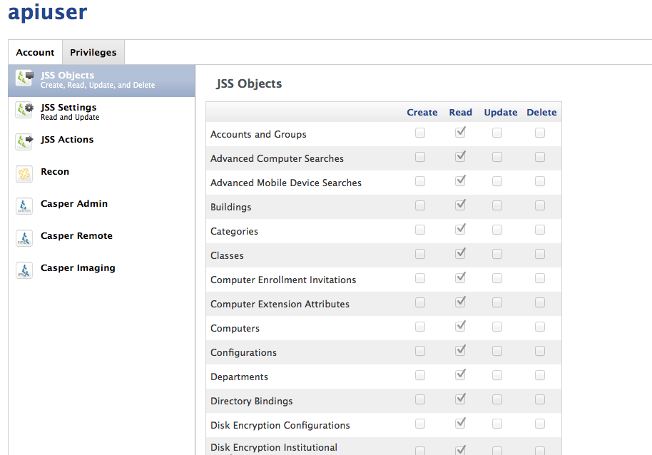

Setup JSS API access
--------------------

The junki script requires read-only access to the JSS API in order to be able to perform some tasks. It reads package, group, network segement and software update information directly from the API.

###Setup a read-only user in Casper admin like this

#####Click
1. Settings
2. Accounts and Settings
3. New
4. Account Tab
	* Username: `apiuser`
	* Access: `Full Access`
	* Email: *blank*
	* Password: *a strong password* - try [here](https://www.random.org/passwords/?num=1&len=24&format=html&rnd=new)
	
	
5. Privleges Tab
	* All Read-Only (check all or)
		* Computers
		* Network Segments
		* Packages
		* Policies
		* Smart Computer Groups
		* Software Update Servers
		* Static Computer Groups
		
	
	
6. Done!
