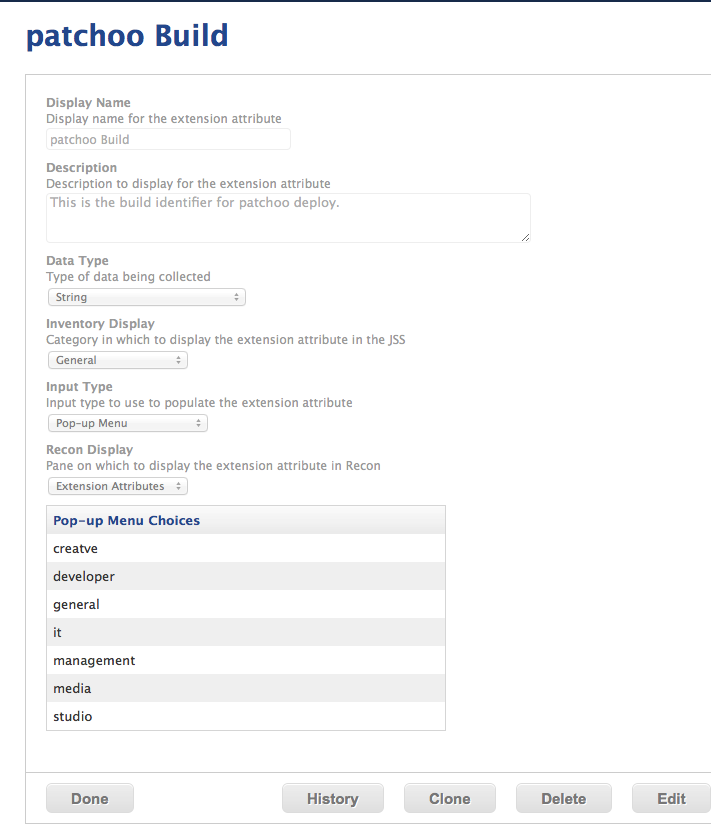

Setup Patchoo Deploy Ext Attribute
----------------------------------

Create the Patchoo Build Extentions Attribute and ensure you use the same name that you specified in previous step.

Display Name: `patchoo Build`

Data Type: `String`

Input Type: `Pop-Up Menu`

Then fill in you own strings for choices. ** Use lowercase, no spaces for consistency **. These build identifiers will be used by patchoo Deploy. During the deployment process, a custom trigger will be fired name `deploy-indentifier` .. eg. `deploy-creative`, `deploy-general` etc..

