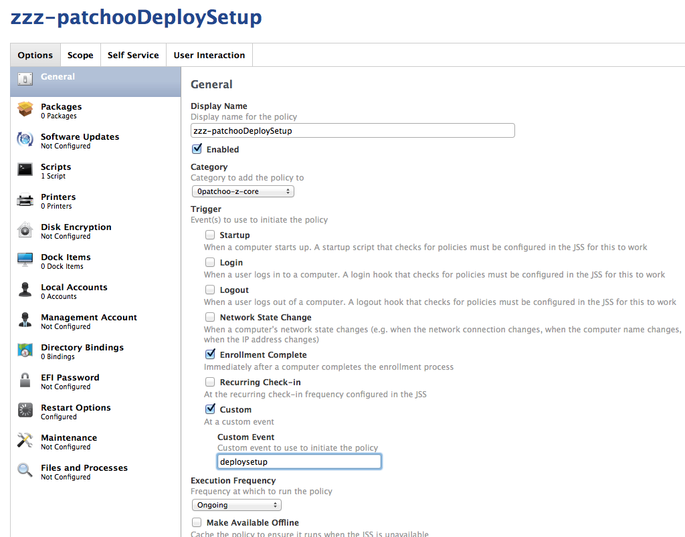
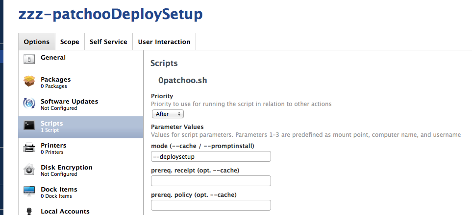

Setup Patchoo Deploy Policy
---------------------------

Patchoo Deploy requires the [Deploy Software Policy](setup_deploy_policy.md). The bootstrap policy drives both the patchoo Deploy and update loop.

Apart from that, you only need a single setup policy. This is trigger by both `enrollment` and a custom `deploysetup` trigger.

`deploysetup` is fired by the [/extras/patchooDeploySetup](/extras/patchooDeploySetup) script in the package that can be added to your Casper Imaging polcies.

Once a mac is imaged, it restarts, the runs `deploysetup` trigger once enrolment is complete.

