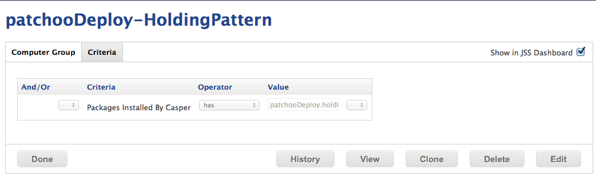
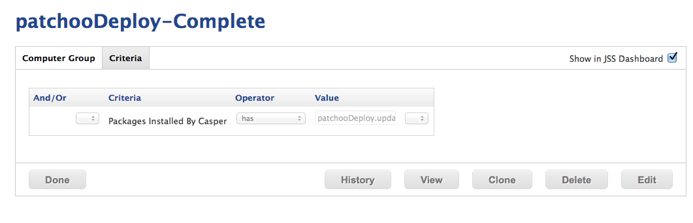

Setup Patchoo Deploy Smart Groups
=================================

Patchoo deploy doesn't REQUIRE and smart groups, but catching Macs that are in a "holding pattern" (eg. are locked in deploy, waiting for provision information) is probably a good idea.

Set these groups to send an email and or display in dashboard.

Criteria

Packages Installed By Casper ***has*** `patchooDeploy.holdingpattern`

----- 

You can also catch Macs that have completed deployment, and have been patched by using:

Criteria

Packages Installed By Casper ***has*** `patchooDeploy.updated`

