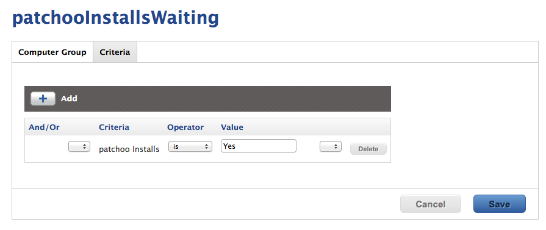
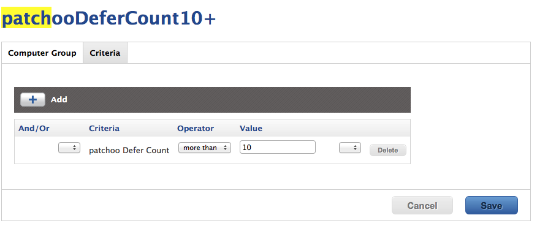

Setup Smart Groups
------------------
patchoo requires a couple of smart groups for core functionality, along with [smart groups to scope software installations](scoping_software_deployment_smart_groups.md).

### patchoo Installs Waiting

**Criteria:** patchoo Installs is *Yes*

This group catches all Macs that have cached installations waiting to be installed.

### patchoo Defer Count 10+

**Criteria:** patchoo Defer Count *more than x*

This group can catch Macs that are deferring past the threshold (perhaps they are meeting room Macs that are unattended).

It's probably also worthwhile setting an email alert, and having this in the dashboard so you can catch non compliant clients that are slipping through the cracks.

