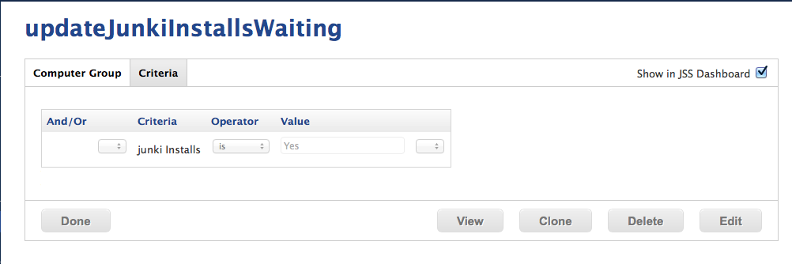
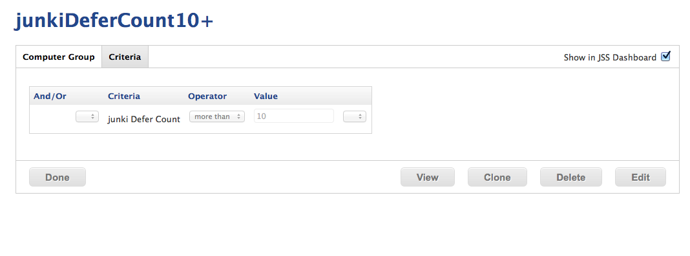

Setup Smart Groups
------------------
junki requires a couple of smart groups for core functionality, along with [smart groups to scope software installations](scoping_software_deployment_smart_groups.md).

### junki Installs Waiting

**Criteria:** junki Installs is *Yes*

This group catches all Macs that have cached installations waiting to be installed.

### junki Defer Count 10+

**Criteria:** junki Defer Count *more than x*

This group can catch Macs that are deferring past the threshold (perhaps they are meeting room Macs that are unattended).

