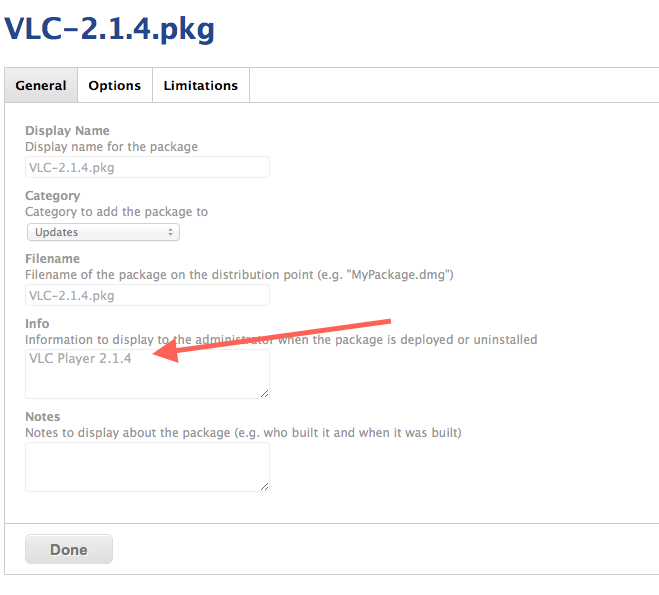
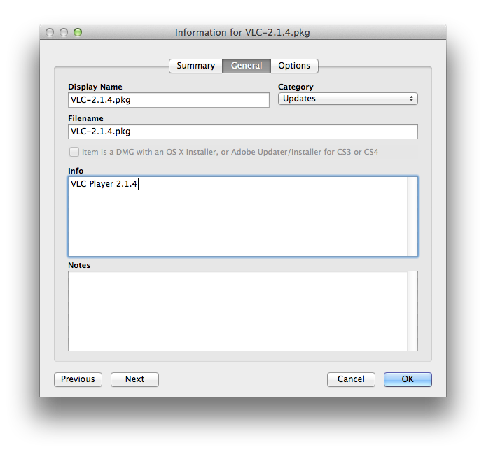

Uploading your pkg into Casper
==============================

Drag and drop your pkgs into Casper Admin as you usually do. The only difference is that you should be adding a *nice name* for the patchoo GUI.

Whatever name you enter into **Info** will be presented to the user. If you don't fill the info metadata, patchoo will use the pkgname, less the extension. eg. `VLC-2.1.4`

