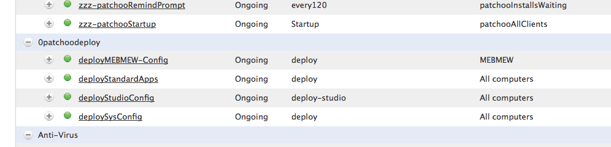

Using Patchoo Deploy
--------------------

You now have a nice framework, which can aid and minimise the number of scoping smart groups you require to perform very complex deployment rules.

Some complex shared environments may build EA for specific department builds, then use departments for their companies, and buildings to scope geographic locations. Others may only use a build identifier or only department. 

Heres a rough example

Expect some better documentation to come!
